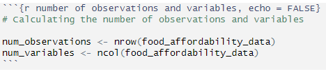

```{r setup, include = FALSE}
knitr::opts_chunk$set(echo = TRUE)
```

```{r libraries, include =  FALSE, message = FALSE, warning = FALSE}
# Loading libraries for the project
library(tidyverse)
library(countrycode)
library(knitr)
```

## Research Question

As rising cost of living has garnered increased attention over recent years due to inflationary pressures on the price of food and energy (<https://www.weforum.org/stories/2022/09/cost-of-living-crisis-global-impact/>, <https://theconversation.com/global-economy-2023-how-countries-around-the-world-are-tackling-the-cost-of-living-crisis-196740>), a large number of people are becoming increasingly vulnerable to food affordability issues. In this project, we will be investigating this issue: how much of the population across the world is at risk of not affording a healthy diet?

## Dataset Introduction

Data for this project was sourced from [Our World in Data](https://ourworldindata.org/food-prices) under the Food Prices Data Explorer in the Food Prices insight, which in turn derived its data from the Food and Agriculture Organization of the United Nations ('FAO') and the World Bank (<https://ourworldindata.org/food-prices>). Three different datasets were used for this project:

-   [Number of people that cannot afford a healthy diet](https://ourworldindata.org/explorers/food-prices?Diet=Healthy+diet&Cost+or+Affordability=Affordability&Affordability+metric=Number+that+cannot+afford&Cost+metric=%25+of+average+food+expenditure&country=NGA~BGD~IND~ETH~MEX~USA~BRA~GBR)

-   [Share of population that cannot afford a healthy diet](https://ourworldindata.org/explorers/food-prices?Diet=Healthy+diet&Cost+or+Affordability=Affordability&Affordability+metric=Share+that+cannot+afford&Cost+metric=%25+of+average+food+expenditure&country=NGA~BGD~IND~ETH~MEX~USA~BRA~GBR)

-   [Cost of a healthy diet as a share of average expenditure on food](https://ourworldindata.org/explorers/food-prices?Diet=Healthy+diet&Cost+or+Affordability=Cost+&Affordability+metric=Share+that+cannot+afford&Cost+metric=%25+of+average+food+expenditure&country=NGA~BGD~IND~ETH~MEX~USA~BRA~GBR)

We will be observing the most recent year (i.e. 2021) that data is readily available for the variables of interest in this project.

The variables of interest *Number of people that cannot afford a healthy diet* and *Share of population that cannot afford a healthy diet* will be looking at both the number and percentage share of a country's population that cannot afford a healthy diet, where: "The cost of a healthy diet is the lowest-cost set of foods available that would meet requirements in dietary guidelines from governments and public health agencies. A diet is defined as unaffordable when its cost, plus basic non-food needs like housing and transportation, exceeds daily income" (<https://ourworldindata.org/food-prices>).

Regarding the third variable *Cost of a healthy diet as a share of average expenditure on food*, it observes the cost of a healthy diet as represented as a ratio against a person's average food expenditure in a particular country.

```{r variable names}
# LIsting the variable names
variable_names <- data.frame(
  Variable_Names = c(
    "Country",
    "Continent",
    "Number of people who cannot afford a healthy diet",
    "Share of the population who cannot afford a healthy diet",
    "Affordability of a healthy diet: ratio of cost to food expenditures"
  ))

kable(variable_names, caption = "Variable Names of Interest")
```

## Dataset Description

The R code chunk below demonstrates the cleaning of the data in order to be fit for analytical purposes.

```{r dataset cleaning, message = FALSE}
# Reading individual CSV files into respective dataframes
number_healthy_diet <- read.csv("Data/number-healthy-diet-unaffordable.csv")

share_healthy_diet <- read.csv("Data/share-healthy-diet-unaffordable.csv")

cost_healthy_diet <- read.csv("Data/cost-healthy-diet-share-food-expenditure.csv")

# Filtering the data for most recent year available and selecting the relevant columns
number_healthy_diet_2021 <- number_healthy_diet %>% 
  filter(Year == 2021) %>% 
  select(Entity, 4)

share_healthy_diet_2021 <- share_healthy_diet %>% 
  filter(Year == 2021) %>% 
  select(Entity, 4)

cost_healthy_diet_2021 <- cost_healthy_diet %>% 
  filter(Year == 2021) %>% 
  select(Entity, 4)

# Merging dataframes based on Entity variable (i.e. Name of Country)
food_affordability_data <- number_healthy_diet_2021 %>%
  left_join(share_healthy_diet_2021, by = "Entity") %>% 
  left_join(cost_healthy_diet_2021, by = "Entity")

# Renaming Entity variable to 'Country' and cleaning header names to introduce spacing

food_affordability_data <- food_affordability_data %>% 
  rename(Country = Entity,
         `Number of people who cannot afford a healthy diet` = Number.of.people.who.cannot.afford.a.healthy.diet,
         `Share of the population who cannot afford a healthy diet` = Share.of.the.population.who.cannot.afford.a.healthy.diet,
         `Affordability of a healthy diet: ratio of cost to food expenditures` = Affordability.of.a.healthy.diet..ratio.of.cost.to.food.expenditures
  )

# Removing invalid entries under 'Country' variable
invalid_country_entries <-  c("East Asia & Pacific (WB)", 
                              "Europe & Central Asia (WB)",
                              "High-income countries",
                              "Latin America & Caribbean (WB)",
                              "Low-income countries",
                              "Lower-middle-income countries",
                              "Middle East & North Africa (WB)",
                              "North America (WB)",
                              "South Asia (WB)",
                              "Sub-Saharan Africa (WB)",
                              "Upper-middle-income countries",
                              "World")

food_affordability_data <- food_affordability_data %>% 
  filter(!Country %in% invalid_country_entries)

# Removing invalid N/A entries under all variable columns
food_affordability_data <- na.omit(food_affordability_data)

# Re-grouping countries by their Continents using the 'countrycode' package
food_affordability_data <- food_affordability_data %>% 
  mutate(
    Continent = countrycode(Country, origin = "country.name", destination = "continent")
  )

# Re-arranging the variables columns
food_affordability_data <- food_affordability_data %>% 
  select(Country, Continent, everything())

```

```{r number of observations and variables, echo = FALSE}
# Calculating the number of observations and variables

num_observations <- nrow(food_affordability_data)
num_variables <- ncol(food_affordability_data)
```

The dataset regarding the affordability of healthy diets contains `r num_observations` observations and `r num_variables` variables. Please note the code to derive the number of observations and variables is, as below:

```{r screenshot, echo = FALSE}
# Implementing the screenshot into the project

```

As observed below, the first two rows of the dataset can be displayed with `str()` to showcase the type of variables within the dataset.

```{r first two rows, echo = FALSE}
# Displaying the first two rows of the dataset
str(food_affordability_data[1:2,])
```

## Data Summary

```{r data summary}
# Summary statistics for 'Number of people who cannot afford a healthy diet' and 'Affordability of a healthy diet: ratio of cost to food expenditures'
data_summary <- food_affordability_data %>% 
  group_by(Continent) %>% 
  summarise(
    Mean_Number = format(mean(`Number of people who cannot afford a healthy diet`, na.rm = TRUE), scientific = FALSE),
    Sum_Number = format(sum(`Number of people who cannot afford a healthy diet`, na.rm = TRUE), scientific = FALSE),
    Mean_Share = format(mean(`Share of the population who cannot afford a healthy diet`, na.rm = TRUE), scientific =  FALSE),
    Median_Share = format(median(`Share of the population who cannot afford a healthy diet`, na.rm = TRUE), scientific = FALSE)
  ) %>% 
  head(10)

kable(data_summary, caption = "Summary statistics of the 'Number of people who cannot afford a healthy diet' and 'Share of the population who cannot afford a healthy diet' variables")
```

From the summary statistics, it appears that the continents of Asia has the highest number of peoples unable to afford a healthy diet then followed Africa (approx. 857 million and 1.612 billion people respectively), although Africa's population maintains a higher mean and median percentage share of the population being unable to afford healthy diets compared to Asia's figures. **Please note that certain continents may not be represented accurately due to unavailable data and smaller pools of countries, such as Oceania (i.e. Australia and Fiji) where Fiji has skewed the represented data for the continent.**

## Visualisations

```{r data visualisation}

# Creating the scatter plot for Affordability of a Healthy Diet across Continents
ggplot(food_affordability_data, aes(x = Continent, y = `Affordability of a healthy diet: ratio of cost to food expenditures`)) +
  geom_point() +
  labs(
    title = "Affordability of a Healthy Diet across Continents",
    x = "Continent",
    y =  "Ratio of Cost to Food Expenditures"
  )
```

The following observations are made for the categorical scatter plot:

- *Countries within the continents of Africa, the Americas, and Asia are displaying data points that surpass 100% of the Ratio of Cost to Food Expenditures, which indicates that people in these nations would have to spend more than their average food expenditure budget to sufficiently afford a healthy diet.*

- In Africa, the highest ratio is 318% for the nation of Burundi, and for Asia, the sole outlier represents Syria at 301%. Both nations are characterised by a past or present history of volatility and conflict, and both struggle considerably with poverty. (<https://www.bbc.com/news/world-africa-13085064>, <https://www.bbc.com/news/world-middle-east-14703856>)

## Conclusion

The research question for this  project originally asked how much of the population across the world is at risk of not affording a healthy diet? From the data summary exercise, it appears that a total sum of 2.686 billion people worldwide do not have the means to afford a healthy diet, with the majority of these people located in the African and Asian continents. In terms of the ratio of cost to average food expenditure, nations in Africa, the Americas, and Asia are more likely to have citizens whose food budgets cannot match the total cost required to purchase the lowest-cost healthy diet for their country. Given a third of the world's population is unable to meet sufficient caloric and nutritional intake, the Director of FAO's Agrifood Economics and Policy Dvision has highlighted that this represents a structural issue in our agrifood systems, and considerable investment in these systems is required for the United Nations to achieve its goal of Zero Hunger by 2030 ((https://www.fao.org/newsroom/detail/healthy-diets-remain-unaffordable-for-a-third-of-the-world-s-population/en). 

## References
